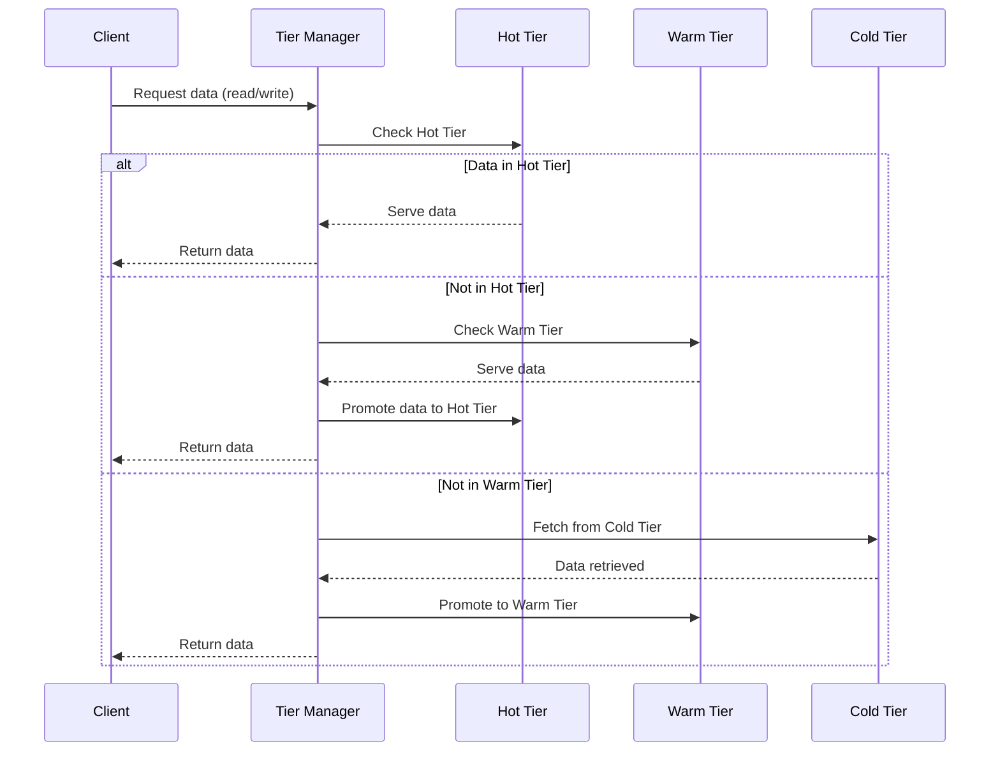
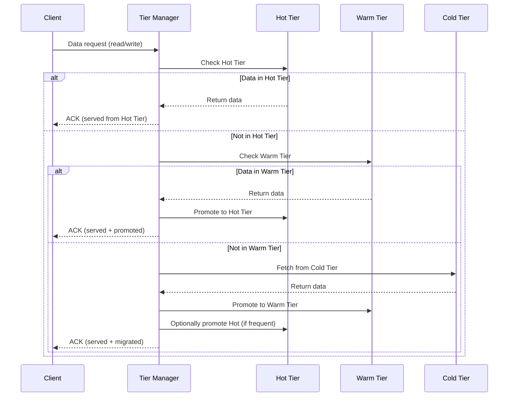

# Storage-Tier Management Prototype

This project is a *prototype storage-tier management system* designed to study and compare data placement, migration, and performance trade-offs across multiple storage tiers:  

- *Hot Tier* (fast but expensive, e.g., SSD / NVMe)  
- *Warm Tier* (balanced, e.g., HDD)  
- *Cold Tier* (cheap, high-capacity, e.g., object storage / tape)  

The system implements a *tier-aware storage manager* where files and blocks are automatically classified, migrated, and retrieved based on *access frequency*, *latency requirements*, and *cost constraints*.  

---

## 📂 Project Structure

```
proto/
└── tier.proto             # gRPC message definitions (placement, migrate, stats)

src/
├── __init__.py
├── api.py                 # Client-facing API (FastAPI / REST)
├── node.py                # Runs a full node (api + schedulers + metrics)
├── metadata_store.py      # Object/file metadata (size, age, access freq, tier)
├── policy_engine.py       # Policy DSL (SLA, cost caps, compliance tags)
├── tier_manager.py        # Placement decisions (hot/warm/cold) + routing
├── migrator.py            # Background moves, compaction, recalls
├── cache_index.py         # LRU/LFU admission & promotion decisions
├── cost_model.py          # $/GB, IOPS caps, egress penalties
├── util.py                # Logging, configs, ID generators

├── tiers/
│   ├── __init__.py
│   ├── hot_ssd.py         # NVMe/SSD driver
│   ├── warm_object.py     # Object store driver (S3/GCS compatible)
│   └── cold_archive.py    # Archive/glacier-like driver

tests/
├── test_policy.py
├── test_tiering_strong.py
├── test_tiering_eventual.py
└── test_integration.py

benchmarks/
├── loadgen.py             # Async client load: read/write/mixed/scan
├── fault_injection.py     # Latency spikes, tier outages, throttling
└── analysis.ipynb         # Plots: p50/p95 latency, cost, promotion rate

docker/
├── Dockerfile
└── docker-compose.yml

requirements.txt
README.md
```
---

## ⚙ Core Components

### Hot Tier (Performance Tier)
- Stored in *SSD or memory-backed* storage.  
- Holds frequently accessed (hot) data.  
- Prioritizes latency-sensitive workloads.  

### Warm Tier (Balanced Tier)
- Stored in *HDDs or mid-range storage*.  
- Balances cost and performance.  
- Holds moderately accessed data.  

### Cold Tier (Archival Tier)
- Stored in *object storage, tape, or cloud*.  
- Holds infrequently accessed data.  
- Optimized for cost savings over performance.  

### Migration Engine
- Moves data between tiers based on policies.  
- Supports *LRU*, *LFU*, *cost-based*, and *predictive (ML)* policies.  
- Ensures seamless access regardless of data tier.  

---
## 🔄 Workflow

### 1. Data Access + Tier Decision

### 2. Tiered Storage Management (Access + Migration)


## 📊 Benchmarks

* **benchmarks/workload_gen.py**: Generates synthetic workloads with hot, warm, and cold data access patterns.  
* **benchmarks/cost_analysis.py**: Simulates storage cost, migration overhead, and tiering efficiency.  
* **benchmarks/analysis.ipynb**: Visualizes hit rates, latency, migration frequency, and storage cost metrics.  

---

## 🚀 Running the Project

### With Docker

```bash
docker-compose up --build
```
---

## ✅ Tiering Policy Comparison

| Feature                  | Hot Tier                    | Warm Tier                    | Cold Tier                     |
| ------------------------ | --------------------------- | ---------------------------- | ----------------------------- |
| *Access Latency*         | Very low (SSD/Memory)       | Moderate (HDD)               | High (cloud/archive storage)  |
| *Storage Cost*           | High                        | Medium                       | Low                           |
| *Data Placement*         | Frequently accessed (hot)   | Moderately accessed          | Infrequently accessed (cold) |
| *Migration Frequency*    | High (promotions/demotions) | Medium                       | Low                           |
| *Use Cases*              | Latency-sensitive workloads | General storage balance      | Archival, backups             |

---

## 📌 Summary

This prototype demonstrates how a *storage-tier management system* can optimize performance and cost by:  

1. Keeping hot data in SSD/memory for low-latency access.  
2. Moving moderately used data to warm storage to balance cost and performance.  
3. Offloading infrequently accessed data to cold storage for cost efficiency.  

The system ensures seamless data access, automatic tier promotions/demotions, and efficient utilization of heterogeneous storage resources.
